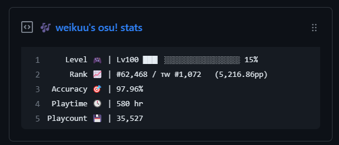

  
  <h3 align="center">📌osu-box🎶</h3>
  

   
   
   
   
  

  
idk but its description here

---

> This project is inspired by [productive-box](https://github.com/maxam2017/productive-box) 
> For more pinned-gist projects like this one, check out: https://github.com/matchai/awesome-pinned-gists

## Overview
This project requests your osu data from api, and automatically update them into a Github Gist, which u can get the gists pinned in your profile.

### Prep work

1. Create a new public GitHub Gist (https://gist.github.com/)
2. Create a token with the `gist` scope and copy it. (https://github.com/settings/tokens/new)

(You can skip the steps below if you have an exist OAuth Application in osu, and you know what you are doing)

3. Login your osu account on osu website (https://osu.ppy.sh/home)
4. Click on your avatar (Right Top), and then **Settings** > Scroll down and look for the **OAuth** section > **New OAuth Application** > Input the infomation(just anything for name and callback url, you can update them later) > **Register Application** > remember the **Client ID** and **Client Secret**, we need them later.

### Project setup

1. Fork this repo
1. Open the "Actions" tab of your fork and click the "enable" button.
1. There will probably also be a toggle option that asking you to enable the schedule workflow, enable that also.
1. Edit the [environment variable](https://github.com/AiverAiva/osu-box/blob/main/.github/workflows/osu-box.yml#L30-L32) in `.github/workflows/osu-box.yml`:

   - **GIST_ID:** The ID portion from your gist url: `https://gist.github.com/AiverAiva/`**`f53231aed6896f053ecbc32ba77b4973`**.
   - **OSU_USERNAME:** Your osu user name. (example: weikuu, mrekk, xootynator, Ekoro)
   - **OSU_MODE:** The stats of which mode you want to display. (`osu`, `fruits`, `mania`, `taiko`)

1. Go to the repo **Settings > Secrets**
1. Add the following environment variables:
   - **GH_TOKEN:** The GitHub token generated above.
   - **CLIENT_ID:** The osu! Client ID generated above.
   - **CLIENT_SECRET:** The osu Client Secret generated above.

1. [Pin the newly created Gist](https://help.github.com/en/github/setting-up-and-managing-your-github-profile/pinning-items-to-your-profile)

The workflow updates daily (00:00), if you want to manually update it, click on the workflow dispatch button in **Actions** > **Update osu-stats gist** > **Run workflow**
